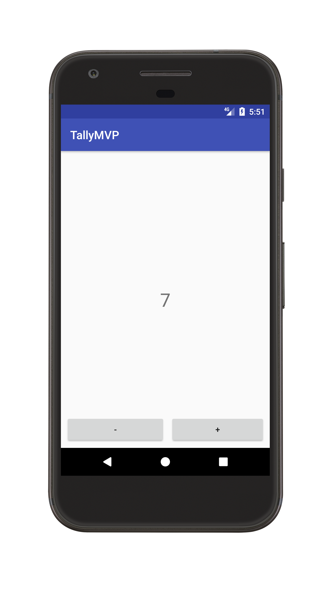

# TallyMVP
A simple project I made to explain the MVP pattern to a friend

### Technologies/Patterns/Libraries
The pattern used for this project is MVP (Model, View, Presenter).
The Only external library, beside the support ones is [ButterKnife](http://jakewharton.github.io/butterknife/),

Every part of the app of the app is isolated, so it's easily testable/maintainable.

### Screenshot
</img>

### How it works (Developer Side)
The user opens the app and then is presented with the ```TallyActivity``` that's
the only activity in this app.

```TallyActivity``` implements ```ITallyView```, declares an instance of a ```TallyPresenter```
and passes to it an instance of the ```TallyModel``` and the implemented ```ITallyView```.

```TallyModel``` implements ```ITallyModel```.

```TallyPresenter``` then manages all the logics.


### How it works (Consumer Side)

The user opens the app.
It has 2 button.

- The '+' button is used to increment the counter;
- The '-' button is used to decrease the counter;
- A long press on the counter resets everything.

### License
You can find the license for this project [here](LICENSE)
